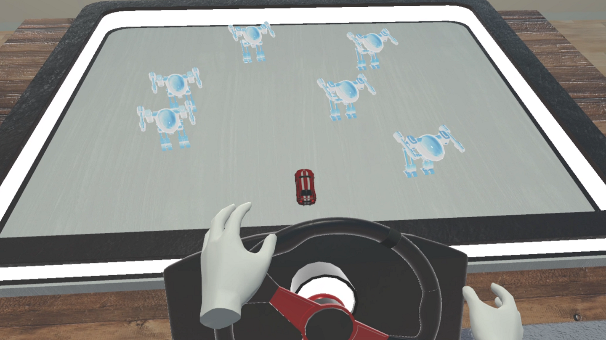

# MechaRacer
## Description
A VR racing game where the objective is to drive a toy car and hit as many mech robots as possible. This was the third homework assignment / final project for the Introduction to XR Systems course (521293A).

## Tools used
- Unity
- Visual Studio Community 2019
- C#
- Meta Quest 2 HMD + controllers
- All meshes were obtained from the Unity Asset Store and other online asset stores.

## Builds
- [Executable](https://drive.google.com/file/d/10G56kzWOM_QlTIAIpRIO2DwQ5HC5dvV3/view?usp=drive_link)
- [Unity Package](https://drive.google.com/file/d/14lpixUZKI7szGmJy7EdCNrFG38Hb0o8N/view?usp=drive_link)

## Controls
For Meta Quest 2:
- Use both **Grip** buttons to *grab* and *turn* the Steering Wheel
- **RT** = *Accelerate*
- **LT** = *Decelerate*

## Demo

